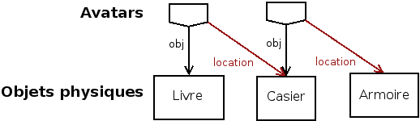

:css: presentation.css
:data-transition-duration: 0

.. header::

   .. image:: anyblok-logo_w_256.png

AnyBlok / WMS  Base
~~~~~~~~~~~~~~~~~~~

Un moteur d'applications de logistique avec Python 3, SQLAlchemy, PostgreSQL et AnyBlok.

Présentation disponible en ligne

https://github.com/gracinet/awb-pyconfr-2018/25mn.rst

.. TODO illustration

- source :
    https://github.com/AnyBlok/anyblok_wms_base
- nouvelles sur mon blog (en français) :
    https://blog.racinet.fr/tag/logistique.html
- documentation de référence (en anglais):
    https://anyblok-wms-base.readthedocs.io/en/latest/

====

Georges Racinet
~~~~~~~~~~~~~~~

- développeur python pro depuis 2005
- fondation Anybox avec Christophe Combelles 2010

  + applis gestion entreprise (ERP), en particulier stocks
  + grande expérience logistique chez Anyboxiens

====

Cas d'utilisation
~~~~~~~~~~~~~~~~~

- commerce en ligne et en magasins
- logistique pure
- gestion de matériel
- gestion de fabrication

====

État du projet
~~~~~~~~~~~~~~

- pure bibliothèque
- 100% libre et développé publiquement
- couverture de tests à 100% depuis le début
- documentation de référence (en anglais) exhaustive
- version actuelle^W de ce soir : 0.8

====

But de la présentation
~~~~~~~~~~~~~~~~~~~~~~

J'assume…

- développeurs, développeurs !

  + primo utilisateurs
  + contributeurs
  + nouvelles briques intermédiaires ?

- nouveau nom ?

====

Cas d'utilisation
~~~~~~~~~~~~~~~~~

- commerce en ligne et en magasins
- logistique pure
- gestion de matériel
- gestion de fabrication

====

Points communs
~~~~~~~~~~~~~~

- objets physiques
- où ? quand ? comment / pourquoi ?
- prévision / planification
- la réalité est têtue, et elle a le dernier mot !

.. note:: Avant passer de passer à du concret, un petit mot sur motivation.

=====

Motivation / objectifs
~~~~~~~~~~~~~~~~~~~~~~

- minimalisme
- généricité
- liberté

  + au sens du logiciel libre
  + guider le code applicatif sans l'entraver
  + la mienne

- performance
- qualité
- réconciliation avec la réalité

=====

Le scénario
~~~~~~~~~~~

- vente de livres en gros 1/2 gros et détail
- on va regarder le cas de *A Dance of Dust and Wind* (par Georges L.P.
  Racinet)
- 3 volumes
- coffret de l'intégrale, préparé à l'entrepôt

=====

Objets physiques : le modèle PhysObj
~~~~~~~~~~~~~~~~~~~~~~~~~~~~~~~~~~~~

On récupère un type, puis les objets physiques de ce type

.. note::
         Prendre son temps sur cet écran.

         - rappeler Anyblok, modèle

         Insister sur première spécificité (une ligne par objet physique):

         - pas de quantité
         - pas de système d'unités

.. code:: python

     >>> PhysObj = registry.Wms.PhysObj
     >>> livre_type = PhysObj.Type.query().filter_by(code='GR-DUST-WIND-VOL2').one())
     >>> exemplaires = PhysObj.query().filter_by(type=livre_type).all()
     >>> exemplaires
     [Wms.PhysObj(id=18, type=Wms.PhysObj.Type(id=7, code='GR-DUST-WIND-VOL2')),
     Wms.PhysObj(id=19, type=Wms.PhysObj.Type(id=7, code='GR-DUST-WIND-VOL2')),
     Wms.PhysObj(id=20, type=Wms.PhysObj.Type(id=7, code='GR-DUST-WIND-VOL2')),
     Wms.PhysObj(id=21, type=Wms.PhysObj.Type(id=7, code='GR-DUST-WIND-VOL2')),
     Wms.PhysObj(id=22, type=Wms.PhysObj.Type(id=7, code='GR-DUST-WIND-VOL2'))]

====

PhysObj : les Propriétés
~~~~~~~~~~~~~~~~~~~~~~~~

En plus du ``type``, on dispose d'un système de propriétés flexibles.

.. code:: python

     >>> exemplaires[0]
     Wms.PhysObj(id=18, type=Wms.PhysObj.Type(id=7, code='GR-DUST-WIND-VOL2')
     >>> exemplaires[0].merged_properties()
     {'lot': '12A345'}

     >>> exemplaires[0].set_property('expo', True)
     >>> exemplaires[0].get_property('expo')
     True

Sous le capot: un champ JSONB, ou des colonnes séparées

====

PhysObj : retour sur les Types
~~~~~~~~~~~~~~~~~~~~~~~~~~~~~~

Si c'est différent (à manipuler) ce n'est pas la même chose !

Donc un carton de 50, c'est un autre type que pour 50 exemplaires:

.. code:: python

    >>> carton = PhysObj.Type.query().filter_by(code='GR-DUST-WIND-VOL1/CARTON').one()
    >>> PhysObj.query().filter_by(type=carton).count()
    0

Et une palette de 80 cartons, c'est encore autre chose que 80
cartons:

.. code:: python

    >>> palette = PhysObj.Type.query().filter_by(code='GR-DUST-WIND-VOL1/PALETTE').one()
    >>> PhysObj.query().filter_by(type=palette).all()
    [Wms.PhysObj(id=20, type=Wms.PhysObj.Type(id=6, code='GR-DUST-WIND-VOL1/PALETTE'))]

====

PhysObj.Avatar : où et quand
~~~~~~~~~~~~~~~~~~~~~~~~~~~~

Les *avatars* encodent la présence d'un objet physique quelque part
pour un certain laps de temps.

.. code:: python

   >>> Avatar = PhysObj.Avatar

   >>> avatars = Avatar.query().filter_by(obj=exemplaires[0]).order_by(Avatar.dt_from).all()
   >>> [(av.state, av.location.code, str(av.dt_from)) for av in avatars]

   [('past', 'QUAI ENTRÉE', '2018-10-06 01:00:40.366405+02:00'),
   ('past', 'CASIER3', '2018-10-06 01:00:40.397054+02:00'),
   ('present', 'EMBALLAGE', '2018-10-06 01:00:40.416139+02:00'),
   ('future', 'QUAI SORTIE', '2018-10-07 13:00:40.416139+02:00')]

Les emplacements sont des objets physiques !

.. code:: python

   >>> avatars[0].location
   Wms.PhysObj(id=2, code='QUAI ENTRÉE', type=Wms.PhysObj.Type(id=1, code='EMPLACEMENT FIXE'))

====

PhysObj.Avatar : où et quand
~~~~~~~~~~~~~~~~~~~~~~~~~~~~

..   :width: 906
..   :height: 581

.. note:: Motivation de la séparation entre ``PhysObj`` et ``PhysObj.Avatar`` :

          - hygiène de base de données
          - réservation

====

PhysObj.Avatar : où et quand
~~~~~~~~~~~~~~~~~~~~~~~~~~~~

..   :width: 906
..   :height: 581

.. note:: Motivation de la séparation entre ``PhysObj`` et ``PhysObj.Avatar`` :

          - hygiène de base de données
          - réservation

====

Opérations
~~~~~~~~~~

.. code:: python

   >>> op = avatars[-1].reason
   >>> op
   Model.Wms.Operation.Move(id=17, state='planned',
                            input=Wms.PhysObj.Avatar(...),
                            destination=Wms.PhysObj(id=4, code='QUAI SORTIE',  ...)
   >>> op.execute()
   >>> avatars[-1].state
   'present'

et pour finir, expédions !

.. code:: python

   >>> registry.Wms.Operation.Departure.create(input=avatars[-1], state='done')
   >>> avatars[-1].state
   'past'

====

Pas de modèle ``Wms.Location``  ?
~~~~~~~~~~~~~~~~~~~~~~~~~~~~~~~~~

Une certaine indirection…

.. note:: AnyBlok / Wms Base fournit ce qu'il faut pour les quantités de
          stocks.

Avantages
---------

- Cas hybrides: racks et bacs, chariots
- Opérations: déplacer, recevoir etc des emplacements
- Typages et propriétés: poubelle, zones techniques

====

Opérations : cycle de vie
~~~~~~~~~~~~~~~~~~~~~~~~~

- les opérations planifiées peuvent être :

   + annulées : ``cancel()``
   + exécutées : ``execute()``
   + commencées : ``start()``

- les opérations faites peuvent être :

  + complètement oubliées : ``obliviate()``
  + renversées par planification d'une inverse *si possible* :
    ``plan_revert()``

====

Opérations : cycle de vie
~~~~~~~~~~~~~~~~~~~~~~~~~

.. image:: operation_lifecycle.png

====

Opérations disponibles
~~~~~~~~~~~~~~~~~~~~~~

- ``Arrival`` : entrée d'objets dans le système
- ``Departure`` : sortie d'objets du système
- ``Move`` : déplacement d'un objet
- ``Unpack`` : déballage
- ``Assembly`` : fabrications simples et empaquetages
- ``Observation`` : changements non ontologiques
- ``Apparition``, ``Disparition`` et ``Teleportation``: homologues de
  ``Arrival``, ``Departure`` et ``Move`` pour les inventaires.

====

Composants d'Anyblok / Wms Base
~~~~~~~~~~~~~~~~~~~~~~~~~~~~~~~

Jusqu'ici, c'était le Blok wms-core. Il y a aussi :

- wms-reservation

  + fonctionnel (FIFO)
  + passage à l'échelle (réduction concurrence DB par préselection)

- wms-quantity : pour les marchandises en vrac

====

Développements futurs
~~~~~~~~~~~~~~~~~~~~~

https://anyblok-wms-base.readthedocs.io/en/latest/improvements.html

Beaucoup de choses intéressantes restent à faire :

- opérations : start() / complete() / abort()
- réécriture de prévisionnel (planification par affinage)
- optimisations en tout genre
- interface utilisateur basique (attention au mauvais générique)
- enrichissement du système de réservations :

  + opérations autorisées
  + gestion des imprévus

- fédération
- nouveaux Bloks intermédiaires :

  + inventaires (pour très bientôt)
  + capacité des emplacements / conteneurs
  + positions *(slots)* dans les emplacements / conteneurs
  + vos idées…

====

But de la présentation
~~~~~~~~~~~~~~~~~~~~~~

Je reviens sur l'objectif initial…

- lancer un petit écosystème

  + primo utilisateurs
  + contributeurs
  + nouvelles briques intermédiaires ?
  + jamais utilisé AnyBlok ? => https://github.com/AnyBlok/anyblok-book

- nouveau nom ?

====

À vous pour les questions et suggestions !
~~~~~~~~~~~~~~~~~~~~~~~~~~~~~~~~~~~~~~~~~~

====

Complément : déballage
~~~~~~~~~~~~~~~~~~~~~~

.. code:: python

   >>> palette
   Wms.PhysObj.Type(id=7, code='GR-DUST-WIND-VOL1/PALETTE')
   >>> palette_av = Avatar.query().join(Avatar.obj).filter_by(type=palette).one()
   >>> palette_av.state, palette_av.location.code
   ('present', 'SALLE1')
   >>> unpack = registry.Wms.Operation.Unpack.create(input=palette_av, state='done')
   >>> len(unpack.outcomes)
   81

   >>> set((avatar.state, avatar.obj.type.code, avatar.location.code)
   ...     for avatar in unpack.outcomes)
   {('present', 'GR-DUST-WIND-VOL1/CARTON', 'SALLE1'),
   ('present', 'PALETTE SUPPORT', 'SALLE1')}

====

Déballage (déclaration)
~~~~~~~~~~~~~~~~~~~~~~~

.. code:: python

   >>> palette
   Wms.PhysObj.Type(id=7, code='GR-DUST-WIND-VOL1/PALETTE')
   >>> palette.behaviours['unpack']
   {'outcomes': [{'forward_properties': ['lot'],
                  'quantity': 80,
                  'required_properties': [],
                  'type': 'GR-DUST-WIND-VOL1/CARTON'},
                 {'forward_properties': [],
                 'quantity': 1,
                 'required_properties': [],
                 'type': 'PALETTE SUPPORT'}]}}

