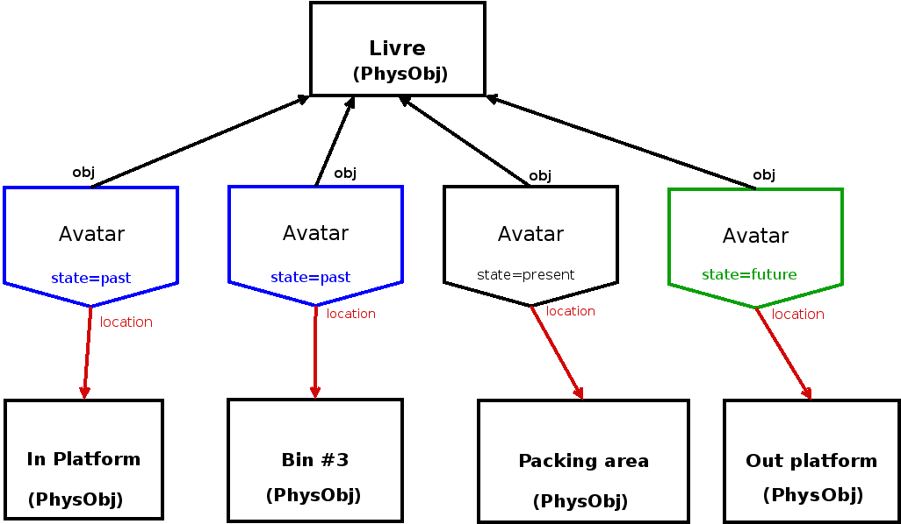
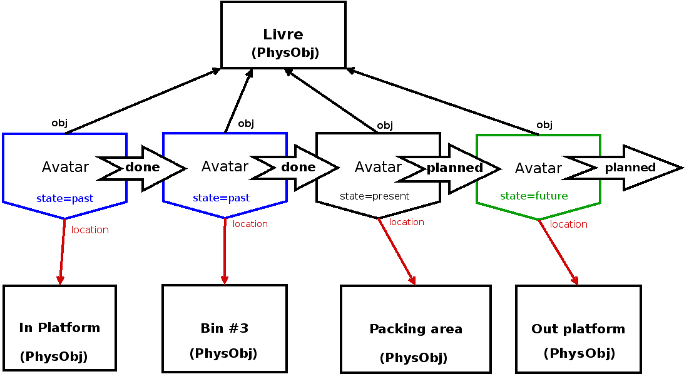
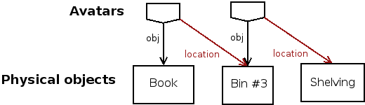
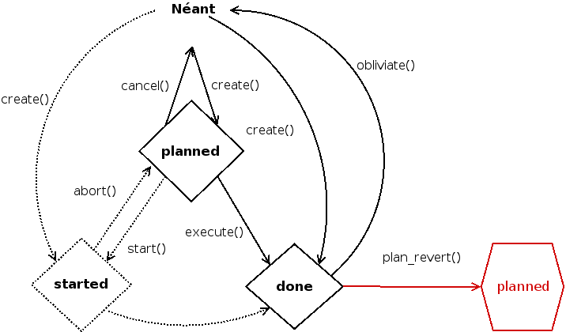

:css: presentation.css
:data-transition-duration: 0

.. header::

   .. image:: anyblok-logo_w_256.png

AnyBlok / WMS  Base (AWB)
~~~~~~~~~~~~~~~~~~~~~~~~~

A stocks and logistics engine with Python 3, SQLAlchemy, PostgreSQL and AnyBlok.

- This presentation:
    + slides: https://slides.racinet.fr/2018/pyparis
    + source and examples: https://github.com/gracinet/awb-pyconfr-2018/

- Anyblok / WMS Base
    + source: https://github.com/AnyBlok/anyblok_wms_base
    + news (in french): https://blog.racinet.fr/tag/logistique.html
    + reference documentation: https://anyblok-wms-base.readthedocs.io

====

Stocks and Logistics ?
~~~~~~~~~~~~~~~~~~~~~~

- ecommerce and classic shops
- pure logistics (carriers)
- manufacturing management
- gear / fleet management

====

State of the project
~~~~~~~~~~~~~~~~~~~~

- pure library
- less than a year old
- 100% free software, publically available (github)
- tests coverage has been 100% since the beginning
- comprehensive reference documentation
- current version: 0.8, aiming to reach 1.0 before 2019

====

Goal of this talk
~~~~~~~~~~~~~~~~~

Let's be honest

- developers, developers !

  + early adopters
  + contributors
  + new middleware bricks ?

- a new name? Anyblok / WMS Base is explicit but cumbersome

====

Use cases
~~~~~~~~~

- ecommerce and classic shops
- pure logistics (carriers)
- manufacturing management
- gear / fleet management

*What do they have in common ?*

====

Common required features
~~~~~~~~~~~~~~~~~~~~~~~~

- it's all about physical objects !
- What ? Where ? When ? How ? Why ?
- forecasting / planning
- history tracking
- must account for stubbornness of reality

.. note:: Before diving in, a bit more about motivation

          history tracking: speak of stock levels

=====

AnyBlok
~~~~~~~

* wrapper framework around SQLAlchemy
* Object-Relational Mapping (ORM)
* Model: a class mapped to a table

Key aspects
-----------

* meant for modularity: Bloks
* dynamical overrides (lateral injection)
* ready for multi-tier applications (SAAS)
    which Blok is active depends on the database
* IPython interpreter wrapper (in display for this talk)
* a few more niceties (simple relationships etc.)

=====

An example scenario
~~~~~~~~~~~~~~~~~~~

Made for this series of talks, and available at
https://github.com/gracinet/awb-pyconfr-2018

- selling books in retail and to businesses (large and medium amounts)
- say it's called *A Dance of Dust and Wind* (by Georges L.P.
  Racinet)
- 3 volumes
- also, box set with all the volumes, whose assembly is done by us

Let's start an IPython interpreter on the example project::

     $ venv/bin/anyblok_interpreter -c demo.cfg
     Loading config file '/etc/xdg/AnyBlok/conf.cfg'
     Loading config file '/home/gracinet/.config/AnyBlok/conf.cfg'
     Loading config file '/home/gracinet/anyblok/awb-pyconfr-2018/demo.cfg'
     Python 3.5.3 (default, Sep 27 2018, 17:25:39)
     Type 'copyright', 'credits' or 'license' for more information
     IPython 7.0.1 -- An enhanced Interactive Python. Type '?' for help.

     In [1]:

=====

Physical objects
~~~~~~~~~~~~~~~~

- Physical objects are encoded by the ``Wms.PhysObj`` Model
- they have a type, whose Model is ``Wms.PhysObj.Type``

Let's fetch one of our example Types,
then the physical objects of that type.

.. note::
         Take your time on this screen, it's the first with actual
         code examples.

         - explain use of registry and Models
         - comment the PhysObj naming choice

.. code:: python

     In [1]: PhysObj = registry.Wms.PhysObj
     In [2]: book_type = PhysObj.Type.query().filter_by(code='GR-DUST-WIND-VOL2').one()
     In [3]: units = PhysObj.query().filter_by(type=book_type).all()
     In [4]: units
     Out[4]:
     [Wms.PhysObj(id=18, type=Wms.PhysObj.Type(id=7, code='GR-DUST-WIND-VOL2')),
     Wms.PhysObj(id=19, type=Wms.PhysObj.Type(id=7, code='GR-DUST-WIND-VOL2')),
     Wms.PhysObj(id=20, type=Wms.PhysObj.Type(id=7, code='GR-DUST-WIND-VOL2')),
     Wms.PhysObj(id=21, type=Wms.PhysObj.Type(id=7, code='GR-DUST-WIND-VOL2')),
     Wms.PhysObj(id=22, type=Wms.PhysObj.Type(id=7, code='GR-DUST-WIND-VOL2'))]

* no ``quantity`` field, a single instance (SQL row) per object
* no unit of measure either
* what about goods kept in bulk?

====

PhysObj: Properties
~~~~~~~~~~~~~~~~~~~

Physical Objects also sport a flexible properties system

.. code:: python

     In [5]: units[0]
     Out[5]: Wms.PhysObj(id=18, type=Wms.PhysObj.Type(id=7, code='GR-DUST-WIND-VOL2')

     In [6]: units[0].merged_properties()
     Out[6]:{'lot': '12A345'}

     In [7]: unit[0].set_property('used-on-display', True)

     In [8]: units[0].get_property('used-on-display')
     Out[9]: True

Under the hood, within the ``flexible`` JSONB field, or separate table
columns.

====

PhysObj: more about Types
~~~~~~~~~~~~~~~~~~~~~~~~~

If handling differs, PhysObj Type must differ

Ex: a crate of 50 must be represented by another Type than 50 units:

.. code:: python

    In [8]: crate = PhysObj.Type.query().filter_by(code='GR-DUST-WIND-VOL1/CRATE').one()

    In [9]: PhysObj.query().filter_by(type=crate).count()
    0

And a pallet of 80 crates is again something else than 80 crates:

.. code:: python

    In [10]: pallet = PhysObj.Type.query().filter_by(code='GR-DUST-WIND-VOL1/PALLET').one()

    In [11]: PhysObj.query().filter_by(type=pallet).all()
    Out[11]: [Wms.PhysObj(id=20, type=Wms.PhysObj.Type(id=6, code='GR-DUST-WIND-VOL1/PALLET'))]

Up to now, we've seen how to answer the first question: "what?", time
to speak of the others!

====

PhysObj.Avatar: when and where
~~~~~~~~~~~~~~~~~~~~~~~~~~~~~~

We use a distinct model, ``Wms.PhysObj.Avatar`` to encode time and
place information about the physical objects.

.. code:: python

   In [12]: Avatar = PhysObj.Avatar

   In [13]: avatars = Avatar.query().filter_by(obj=units[0]).order_by(Avatar.dt_from).all()

   In [14]: [(av.state, av.location.code, str(av.dt_from)) for av in avatars]
   Out[14]:
   [('past', 'IN PLATFORM', '2018-10-06 01:00:40.366405+02:00'),
   ('past', 'BIN #3', '2018-10-06 01:00:40.397054+02:00'),
   ('present', 'PACKING AREA', '2018-10-06 01:00:40.416139+02:00'),
   ('future', 'OUT PLATFORM', '2018-10-07 13:00:40.416139+02:00')]

Locations are nothing but instances of ``Wms.PhysObj`` (!)

.. code:: python

   In [15]: avatars[0].location
   Out[15]: Wms.PhysObj(id=2, code='IN PLATFORM',
                        type=Wms.PhysObj.Type(id=1, code='EMPLACEMENT FIXE'))

====

PhysObj.Avatar: where and when
~~~~~~~~~~~~~~~~~~~~~~~~~~~~~~

..   :width: 906
..   :height: 581

.. note:: Motivation de la séparation entre ``PhysObj`` et ``PhysObj.Avatar`` :

          - hygiène de base de données
          - réservation

====

PhysObj.Avatar: where and when
~~~~~~~~~~~~~~~~~~~~~~~~~~~~~~

..   :width: 906
..   :height: 581

.. note:: Motivation de la séparation entre ``PhysObj`` et ``PhysObj.Avatar`` :

          - hygiène de base de données
          - réservation

====

Operations: how and why
~~~~~~~~~~~~~~~~~~~~~~~

.. code:: python

   In [16]: op = avatars[-1].reason  # will be outcome_of from 0.9 onwards

   In [17]: op
   Out[17]: Model.Wms.Operation.Move(id=17, state='planned',
                                     input=Wms.PhysObj.Avatar(...),
                                     destination=Wms.PhysObj(id=4,
                                                             code='OUT PLATFORM',
                                                             ...))

   In [18]: op.execute()

   In [19]: avatars[-1].state
   Out[19]: 'present'

To conclude, let's ship!

.. code:: python

   In [20]: registry.Wms.Operation.Departure.create(input=avatars[-1], state='done')

   In [21]: avatars[-1].state
   Out[21]: 'past'

====

No separate Location Model ?
~~~~~~~~~~~~~~~~~~~~~~~~~~~~

This makes for a bit of indirection…

.. note:: AWB does provide high level methods to compute stock
          quantities

Benefits
--------

- Hybrid cases (trays, carts, flight cases) readily supported
- all Operations are available for locations / containers: moving,
  receiving, scraping…
- Type and Properties for locations: trash, special purpose areas

====

Operations: lifecycle
~~~~~~~~~~~~~~~~~~~~~

- states: planned, started, done

- planned Operations can be:

   + canceled: ``cancel()``
   + executed : ``execute()``
   + started: ``start()``

- done Operations can be:

  + completely forgotten: ``obliviate()``
  + reverted by planning a reverse Operation *if possible*:
    ``plan_revert()``

====

Opérations: lifecycle
~~~~~~~~~~~~~~~~~~~~~

====

Available Operations
~~~~~~~~~~~~~~~~~~~~

- ``Arrival`` : regular entry of objects in the system
- ``Departure``: typically for shipping
- ``Move``
- ``Unpack``
- ``Assembly``: simple manufacturing and packing
- ``Observation``: non ontological changes of Properties
- ``Apparition``, ``Disparition`` et ``Teleportation``: inventory
  counterparts of ``Arrival``, ``Departure`` and ``Move``.

====

Other AWB components
~~~~~~~~~~~~~~~~~~~~

Up to now, all we've seen is provided by the ``wms-core`` Blok. We
also have:

- wms-reservation

  + functional purposes(FIFO)
  + scaling by reducing DB contention

- wms-quantity: for goods stored in bulk

====

Future developments
~~~~~~~~~~~~~~~~~~~

General ideas page:
https://anyblok-wms-base.readthedocs.io/en/latest/improvements.html

Lots of interesting things remain to be done:

- operations: start() / complete() / abort()
- planning alterations (in progress for 0.9)
- various optimisations
- basic UI
- enrichment of the reservation system:

  + authorised Operations
  + recovery on unforeseen conditions

- federation
- new Bloks:

  + inventories (in progress)
  + location / container capacity
  + *(slots)* within location / containers
  + your ideas !

====

Presentation goals
~~~~~~~~~~~~~~~~~~

Let's rephrase the goals I stated near the beginning

- starting a new ecosystem

  + early adopters
  + contributors
  + new intermediate bricks
  + never used AnyBlok ? => https://github.com/AnyBlok/anyblok-book

- a new name ? Please, my tongue is sore !

====

Questions, suggestions?
~~~~~~~~~~~~~~~~~~~~~~~

====

Complements: unpacking
~~~~~~~~~~~~~~~~~~~~~~

Let's unpack a pallet:

.. code:: python

   In [22]: pallet
   Out[22]: Wms.PhysObj.Type(id=7, code='GR-DUST-WIND-VOL1/PALLET')

   In [23]: pallet_av = Avatar.query().join(Avatar.obj).filter_by(type=pallet).one()

   In [24]: pallet_av.state, pallet_av.location.code
   Out[24]: ('present', 'SALLE1')

   In [25]:unpack = registry.Wms.Operation.Unpack.create(input=pallet_av, state='done')
   Out[25]: len(unpack.outcomes)
   81

   In [26]: set((avatar.state, avatar.obj.type.code, avatar.location.code)
       ...:     for avatar in unpack.outcomes)
   Out[26]:
   {('present', 'GR-DUST-WIND-VOL1/CRATE', 'SALLE1'),
   ('present', 'PALLET WOOD', 'SALLE1')}

====

Unpacking declaration
~~~~~~~~~~~~~~~~~~~~~

Let's introspect it:

.. code:: python

   In [27]: pallet
   Out[27]: Wms.PhysObj.Type(id=7, code='GR-DUST-WIND-VOL1/PALLET')

   In [28] pallet.behaviours['unpack']
   Out[28]:
   {'outcomes': [{'forward_properties': ['lot'],
                  'quantity': 80,
                  'required_properties': [],
                  'type': 'GR-DUST-WIND-VOL1/CRATE'},
                 {'forward_properties': [],
                 'quantity': 1,
                 'required_properties': [],
                 'type': 'PALLET WOOD'}]}}

