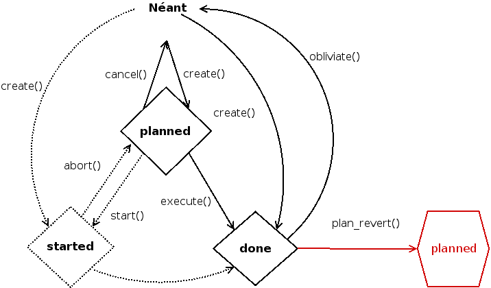

:css: presentation.css

AnyBlok / WMS  Base
~~~~~~~~~~~~~~~~~~~

Un moteur d'applications de logistique avec Python 3, SQLAlchemy, PostgreSQL et AnyBlok.

.. TODO illustration

- source :
    https://github.com/AnyBlok/anyblok_wms_base
- nouvelles sur mon blog (en français) :
    https://blog.racinet.fr/tag/logistique.html
- documentation de référence (en anglais):
    https://anyblok-wms-base.readthedocs.io/en/latest/

====

Cas d'utilisation
~~~~~~~~~~~~~~~~~

- commerce en ligne et en magasins
- logistique pure
- gestion de matériel
- gestion de fabrication

====

État du projet
~~~~~~~~~~~~~~

- pure bibliothèque
- 100% libre et développé publiquement
- couverture de tests à 100% depuis le début
- documentation de référence (en anglais) exhaustive
- version actuelle 0.8

====

But de la présentation
~~~~~~~~~~~~~~~~~~~~~~

J'assume…

- développeurs, développeurs !

  + primo utilisateurs
  + contributeurs
  + nouvelles briques intermédiaires ?

- nouveau nom ?

====

Cas d'utilisation
~~~~~~~~~~~~~~~~~

- commerce en ligne et en magasins
- logistique pure
- gestion de matériel
- gestion de fabrication (GPAO)

=====

Cas d'utilisation
~~~~~~~~~~~~~~~~~

- commerce en ligne et en magasins
- logistique pure
- gestion de matériel
- gestion de fabrication (GPAO)

Points communs:

- objets physiques
- prévision / planification
- la réalité est têtue, et elle a le dernier mot !

=====

Motivation / objectifs
~~~~~~~~~~~~~~~~~~~~~~

- minimalisme
- généricité
- liberté

  + au sens du logiciel libre
  + guider le code applicatif sans l'entraver

- performance
- qualité
- réconciliation avec la réalité

=====

Composants
~~~~~~~~~~

AnyBlok / WMS Base est fait de plusieurs Bloks :

- wms-core : Quoi ? Où ? Quand ? Pourquoi ?
- wms-reservation : système de réservation
- wms-quantity : surtout pour les marchandises en vrac

Concentrons nous un peu sur wms-core

=====

wms-core : concepts centraux
~~~~~~~~~~~~~~~~~~~~~~~~~~~~

https://anyblok-wms-base.readthedocs.io/en/latest/core_concepts.html

Deux familles de concepts dans wms-core :

- les objets physiques
- les opérations portant sur les objets physiques

Les emplacements sont des objets physiques !

====

Objets physiques
~~~~~~~~~~~~~~~~

- modèle ``Wms.PhysObj``
- un objet physique, une ligne en base

  + vraiment ?
  + si trop restrictif : wms-quantity

- champ *type*
- champ *properties* : propriétés flexibles
- champ *code* (optionnel)

====

Objets physiques : le type
~~~~~~~~~~~~~~~~~~~~~~~~~~

Si c'est différent, ce n'est pas la même chose !

- la notion de produit est souvent trop abstraite
- doit correspondre à une réalité physique

.. TODO photo bouteilles d'eau ? tourets ?

Exemples de distinctions :

- six bouteilles d'eau vs pack de 6
- une palette de canettes vs 80 packs de 24
- emballage ouvert ou non

====

Objets physiques : les propriétés
~~~~~~~~~~~~~~~~~~~~~~~~~~~~~~~~~
Tout ce qui ne découle pas du *type* !

Exemples :

- numéros de série, de lot
- dates d'expiration
- prix d'achat

Techniquement :

- clef / valeur
- JSONB ou colonne
- mutualisation transparente par un mécanisme de copie à l'écriture (COW)

====

Objets physiques : démo
~~~~~~~~~~~~~~~~~~~~~~~

====

Ontologie des objets physiques
~~~~~~~~~~~~~~~~~~~~~~~~~~~~~~

- deux instances de ``PhysObj`` de même type et propriétés, sans
  ``code`` individuel sont indiscernables, mais Anyblok
  / Wms Base va les considérer comme différents. Ce n'est
  pas un problème en pratique si l'on fait attention.

- l'instance de ``PhysObj`` représente l'être de l'objet, qui n'est
  qu'une question de point de vue, à résoudre en fait par le
  développeur applicatif.

====

Objets physiques : les avatars
~~~~~~~~~~~~~~~~~~~~~~~~~~~~~~

Les *avatars* encodent la présence d'un objet physique quelque part
pour un certain laps de temps.

- modèle: ``Wms.PhysObj.Avatar``
- champ *location* (un autre objet physique)
- champ *state*: passé, présent ou futur
- champs *dt_from*, *dt_until* : dates et heures de début et de fin

Motivation de la séparation entre ``PhysObj`` et ``PhysObj.Avatar`` :

- hygiène de base de données
- réservation

====

Pas de modèle ``Wms.Location``  ?
~~~~~~~~~~~~~~~~~~~~~~~~~~~~~~~~~

Une certaine indirection…

.. image:: av_loc_chain.png
    :width: 777px
    :height: 225px

Avantages
---------

- Cas hybrides: racks et bacs, chariots
- Opérations: recevoir un casier
- Typages et propriétés: poubelle, zones techniques

====

Opérations
~~~~~~~~~~

Espace de nommage : ``Wms.Operation``

- Arrival, Move, Departure…
- représente l'historique
- permet la planification
- entrées et sortie : des avatars
- états: ``planned``, ``started`` et ``done``

En principe, dans le code applicatif, toute manipulation des objets
physiques (ou de leurs avatars) doit se faire par des Opérations

====

Opérations : cycle de vie
~~~~~~~~~~~~~~~~~~~~~~~~~

- les opérations planifiées peuvent être :

   + annulées : ``cancel()``
   + exécutées : ``execute()``
   + commencées : ``start()``

- les opérations faites peuvent être :

  + complètement oubliées : ``obliviate()``
  + renversées par planification d'une inverse *si possible* :
    ``plan_revert()``

====

Opérations : cycle de vie
~~~~~~~~~~~~~~~~~~~~~~~~~

====

Opérations disponibles
~~~~~~~~~~~~~~~~~~~~~~

- ``Arrival`` : entrée d'objets dans le système
- ``Departure`` : sortie d'objets du système
- ``Move`` : déplacement d'un objet
- ``Unpack`` : déballage
- ``Assembly`` : fabrications simples et empaquetages
- ``Observation`` : changements non ontologiques
- ``Apparition``, ``Disparition`` et ``Teleportation``: homologues de
  ``Arrival``, ``Departure`` et ``Move`` pour les inventaires.

====

Réservation
~~~~~~~~~~~

Deux intérêts de la réservation :

- fonctionnel : par exemple, traiter des commandes client dans l'ordre
- technique : réduction de la concurrence en base de données

Fonctionnalités apportées par le blok ``wms-reservation``

====

Réservation : les principes
~~~~~~~~~~~~~~~~~~~~~~~~~~~

- la demande de réservation (``Wms.Reservation.Request``) :

   + un ensemble de besoins en objets physiques
   + correspondant à un objectif (champ *purpose*) : livraison client,
     fabrication…

- la réservation (``Wms.Reservation``) porte sur un objet physique en
  lien avec une demande de réservation.

Quand un objet est réservé…

- il peut très bien ne pas encore être présent !
- la création d'opérations le concernant est prohibée…
- sauf si l'on prend la main explicitement avec ``claim_reservations()``.

====

Réservation : architecture parallèle
~~~~~~~~~~~~~~~~~~~~~~~~~~~~~~~~~~~~

Pour passer à l'échelle, il est essentiel de pouvoir multiplier les
processus et de limiter la concurrence en base de données.

- processus réservateur (séquentiel) :

    itère sur les demandes de réservation dans l'ordre et cherche à les
    satisfaire. Peu parallélisable, mais travail très simple.

- processus planificateur (parallélisable) :

    itère sur les demandes satisfaites, et planifie les Opérations
    adéquates en fonction de l'objectif. C'est lui qui effectuera les
    tâches les plus lourdes.

- processus utilisateur (parallélisable)

====

Développements futurs
~~~~~~~~~~~~~~~~~~~~~

Beaucoup de choses intéressantes restent à faire :

- start / finish / abort
- réécriture de prévisionnel (planification par affinage)
- optimisations en tout genre
- interface utilisateur basique (attention au mauvais générique)
- enrichissement du système de réservations :

  + opérations autorisées
  + gestion des imprévus

- fédération
- nouveaux Bloks intermédiaires :

  + inventaires (pour très bientôt)
  + capacité des emplacements / conteneurs
  + positions *(slots)* dans les emplacements / conteneurs
  + vos idées…

====

But de la présentation
~~~~~~~~~~~~~~~~~~~~~~

Je reviens sur mon objectif…

- lancer un petit écosystème

  + primo utilisateurs
  + contributeurs
  + nouvelles briques intermédiaires ?

- nouveau nom ?
